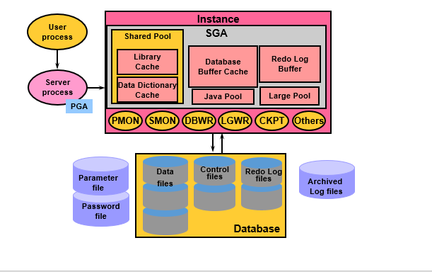

# Thành phần cấu trúc Oracle

## Oracle Server

- Là tập hợp các file, tiến trình (processes) và cấu trúc bộ nhớ trong Oracle Server.
- Oracle Server bao gồm 2 thành phần chính là:
  - Oracle Instance
  - Oracle Database.
