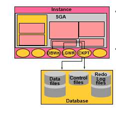

## Các loại tiến trình

- User process:
  - Khởi động vào thời điểm một CSDL người sử dụng yêu cầu kết nối với Oracle Server.
- Server process:
  - Kết nối với Oracle instance và được khởi động khi người sử dụng thiết lập một session, được sinh ra để phục vụ yêu cầu từ user process.
  - Giao tiếp với oracle server và trả lại kết quả cho user process
- Background processes:

  - Khởi động khi một Oracle instance khởi động.
  - Là một tiến trình chạy ngầm khi instance được khởi động thực hiện nhiệm vụ luôn duy trì hoạt động thông suốt của CSDLnhư quản lý memory, process, quản lý I/O, giao tiếp giữa các thành phần…
  - Bắt buộc
  - 
  - Database Writer (DBWn): ghi sự thay đổi blocks từ database buffer cache xuống data files.
    - 
  - Log Writer (LGWR):
    - 
  - System Monitor (SMON): Khôi phục Instance, Giải phòng vùng nhớ.

    - 

  - Process Monitor (PMON): Theo gõi user process, khôi phục process khi bị lỗi

    - 

  - Checkpoint (CKPT): cập nhật checkpoint

    - 

  - Archiver (ARCn)
    - 

## Các mô hình kết nối

- 
- Session:
  - Session là một kết nối riêng của một user đến một Oracle server. Session được bắt đầu khi một user xác thực thành công đến một Oracle server, và kết thúc khi user đăng xuất hoặc bị kết thúc đột ngột.
  - Từ một máy client (database user), có thể có nhiều kết nối đến Oracle server khi người dùng sử dụng nhiều công cụ hoặc ứng dụng khác nhau đăng nhập vào Oracle server.
  - 
- Client-Serve
  - Chương trình trực quan trên máy tính của bạn và kết nối tới một database Oracle nằm trên một máy tính khác, bạn cần phải cài đặt Oracle Client hoặc cài luôn một Oracle Database trên máy tính của mình. Chú ý: Oracle Database đóng vai trò vừa là server vừa là Oracle Client.
  - 
- Host-Based:
  - Chương trình trực quan nằm trên máy tính của bạn và kết nối tới database Oracle nằm cùng máy tính, lúc đó Database này vừa đóng vai trò là một Oracle Server vừa là Oracle Client. Bạn không cần cài thêm gì khác.
  - 
- Client-Application-serve
  - Mô hình 3 lớp
  - User có thể truy cập vào cơ sở dữ liệu từ máy tính cá nhân của họ (Client) thông qua một ứng dụng máy chủ (application server), nơi sử dụng cho những yêu cầu chạy chương trình.
  - 
