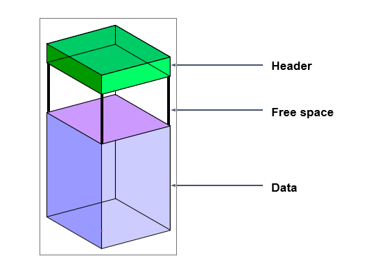

### Tablespace

- Tablespace chỉ thuộc về một Database duy nhất.
- Một Tablespace bao gồm một hay nhiều tập tin vật lý dùng để lưu trữ dữ liệu, đó là Data File.
- Tablespace được tạo nên bởi sự kết hợp của một hay nhiều đơn vị lưu trữ Logic gọi là Segment, một Segment được chia thành nhiều Extent và trong Extent thì có nhiều Data Block liên tục nhau.
  - Data block:
    > Là đơn vị lưu trữ Logic nhỏ nhất được Oracle sử dụng trong việc đọc và ghi dữ liệu trong Oracle Database.
  - Extent
    > Tập hợp nhiều Data Block liên tiếp nhau sẽ tạo thành một đơn vị lưu trữ Logic lớn hơn gọi là Extent. Số lượng Data Block của một Extent tùy thuộc vào kích thước được chỉ định cho Extent khi tạo đối tượng Table.
  - Segment:
    > Segment là tập hợp một số Extent dùng để chứa toàn bộ thông tin của cấu trúc lưu trữ Logic bên trong Tablespace, như là Table.
- Câu lệnh:

  - Show đường dẫn hiện tại db:
    ` select file_name from dba_data_files where tablespace_name = 'USERS';`
  - Tạo:
    `create tablespace userdata datafile 'G:\APP\ORACLE\ORADATA\userdata1.dbf' size 1M;`
  - Thay đổi kích thước:  
    `alter database datafile 'G:\APP\ORACLE\ORADATA\userdata1.dbf' resize 2M;`
  - Thêm datafile
    `alter tablespace userdata add datafile 'G:\APP\ORACLE\ORADATA\userdata2.dbf' size 1M;`
  - Drop:
    `drop tablespace userdata including contents and datafiles;`
  - Thay đổi trạng thái:
    `alter tablespace userdata offline;`
  - Các bảng thông tin:

    - > DBA_TABLESPACES;
    - `select * from v$tablespace;`,
    - `select tablespace_name from dba_tablespaces;`

  - 

### Datafile

- Truy vấn thông tin
  - `select file_name from dba_data_files;`
  - `select name from v$datafile;`
- Tự động mở rộng datafile
  - `create tablespace userdata datafile 'G:\APP\ORACLE\ORADATA\userdata1.dbf' size 1M autoextend on next 1M maxsize 50M;`

### Segments

1. Các loại Segments

- User segments
- Temporary Segments
  > Khi một user thực hiện các lênh như CREATE INDEX, SELECT DISTINCT, và SELECT GROUP BY, Oracle sẽ cố gắng thực hiện công việc sắp xếp ngay trong bộ nhớ. Khi công việc sắp xếp cần đến nhiều không gian hơn, các kết quả này sẽ được ghi trực tiếp lên đĩa. Temporary segments sẽ được dùng đến trong trường hợp này.
- Undo Segments
  >     Undo segment được sử dụng trong transaction (giao dịch) để tạo các thay đổi trong database. Trước khi thay đổi các dữ liệu hay các index blocks, các giá trị cũ sẽ được lưu giữ vào undo segments. Việc làm này cho phép user có thể phục hồi lại các thay đổi.
- Bảng thông tin
  - > dba_segments
  - > ` select SEGMENT_NAME, OWNER from dba_segments where owner = 'A';`
  - > `SELECT segment_name, tablespace_name, blocks FROM dba_segments WHERE owner = 'SCOTT'`

### Extent

- Extent là đơn vị lưu trữ logic bao gồm các data block. Một segment bao gồm một hoặc nhiều extent.
- Một extent được cấp phát khi segment được:
  - Tạo ra
  - Mở rộng
  - Thay đổi
- Một extent bị thu hồi khi segment bị:
  - Xóa bỏ
  - Thay đổi
  - Cắt bớt
- Bảng thông tin
  - > dba_extents

### Block

- Là đơn vị lưu trữ nhỏ nhất của Oracle database.
- Mỗi data block có kích thước bằng một số byte. Mặc định là 8 KB. Tham số DB_BLOCK_SIZE quy định kích thước này.
- Cấu trúc:
  

### Câu lệnh

- ` select segment_name, tablespace_name from dba_segments where owner = 'SYS';`
