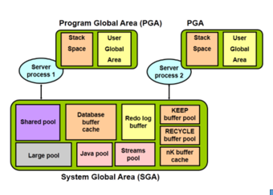

## Cấu trúc bộ nhớ

- 

### Gồm 2 vùng nhớ:

### Vùng nhớ hệ thống SGA:

- > được cấp phát khi instance khởi tạo, và đây là một thành phần cơ bản của một Oracle instance

1.  Bao gồm

- shared pool: lưu trữ

      - Các lệnh SQL thực hiện gần đây nhất
      - Những định nghĩa dữ liệu được sử dụng gần đây nhất
      - Bao gồm hai cấu trúc bộ nhớ liên quan tới hoạt động chính:

      - Library Cache: Lưu trữ thông tin về các lệnh SQL và PL/SQL được sử dụng gần đây nhất.
      - Data Dictionary Cache: chứa các thông tin về database, cấu trúc database, thông tin về user… để hỗ trợ trong việc thực thi các câu lệnh.
      - Được xác định kích cỡ qua tham số SHARED_POOL_SIZE

- Database Buffer Cache:

  - Lưu trữ các bản sao của các khối dữ liệu lấy từ các data file.
  - Cải thiện hoạt động khi truy vấn và cập nhật dữ liệu

- Redo Log Buffer:

  - Redo log buffer là phần bộ nhớ chứa những thay đổi trên database, do các câu lệnh DML, DDL hay do các hoạt động nội bộ trong database.
  - Khi Redo log buffer đầy 1/3 hoặc cứ sau mỗi 3 giây, Log writer process sẽ ghi vào Redo log files, để lấy chỗ cho những nội dung thay đổi mới.
  - Kích thước được xác định thông qua tham số LOG_BUFFER
  - Mục đích để khôi phục CSDL khi xảy ra lỗi

## Vùng nhớ chương trình PGA:

- > được cấp phát khi server process khởi tạo
- là phần bộ nhớ riêng cho mỗi server process, lưu thông tin về phiên làm việc.

      – Private SQL Area: chứa các bind variables, thông tin về câu query (ví dụ như số dòng khi thực hiện truy vấn…).
      – SQL Work Areas: vùng bộ nhớ này dùng cho các hoạt động khác liên quan đến câu query  như sắp xếp, lọc,..

  - Được giải phóng khi server process đó chấm dứt hoạt động
  - Chỉ được sử dụng bởi một server process
