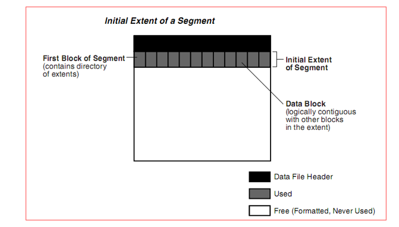
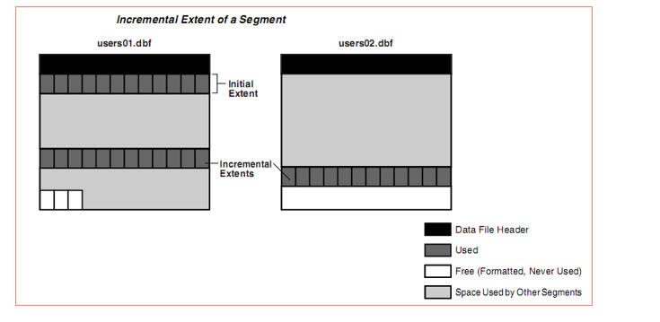
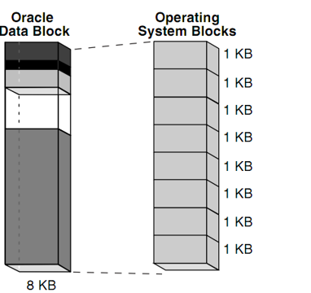
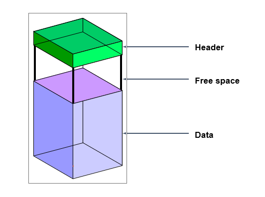

# Database:

> Oracle Database dùng để lưu trữ và cung cấp thông tin cho người dùng. Việc quản lý dữ liệu trong Oracle Database thông qua cấu trúc lưu trữ logic và vật lý.

## Thành phần vật lý:

- > chỉ chứa dữ liệu của 1 db
- Data file: (.dbf)
  - Lưu tất cả dữ liệu của duy nhất một database
  - Kích thước có thể tự động tăng theo kích thước database
  -
- Redo Log file:

  - Lưu trữ thông tin thay đổi
  - > Các redo log files được chia vào các log group. Mỗi log group cũng nên có 2 redo log files trở lên để đảm bảo khi có 1 file lỗi thì vẫn còn file còn lại để hệ thống hoạt động.
  - > Cần ít nhất 2 log group trong database.

  - Các trạng thái:
    - UNUSED: log group mới tạo, chưa sử dụng bao giờ
    - CURRENT: log group đang được ghi dữ liệu
    - ACTIVE: log group đang không ghi dữ liệu, nhưng đang cần phòng trường hợp instance lỗi
    - INACTIVE: log group đang không ghi dữ liệu, không cần trong trường hợp instance lỗi

- Control file: (.ctl)
  - chứa thông tin về cấu trúc database: tên, nơi lưu trữ của datafile, redo log file
  - Là một tập tin quan trọng, nếu không có nó sẽ không mở được database.

# Tạo CSDL

- Để tạo một CSDL mới, bạn cần phải có các điều kiện sau:
  - Một account đủ quyền tạo CSDL.
  - Bộ nhớ đủ để khởi động một instance.
  - Đĩa đủ dung lượng cho CSDL đã lên kế hoạch.

## Công cụ: DBCA

## Dòng lệnh

- Xóa DB : mynewdb
  - > `set oracle_sid=mynewdb`
  - > `sqlplus / as sysdba`
  - > `shutdown immediate;`
  - > `startup mount exclusive restrict;`
  - > `drop database;`
  - > `Quit`;
  - > `sc delete oracleservicemynewdb`

## Cấu trúc logic

### Tablespace

- Tablespace chỉ thuộc về một Database duy nhất.
- Một Tablespace bao gồm một hay nhiều tập tin vật lý dùng để lưu trữ dữ liệu, đó là Data File.
- Tablespace được tạo nên bởi sự kết hợp của một hay nhiều đơn vị lưu trữ Logic gọi là Segment, một Segment được chia thành nhiều Extent và trong Extent thì có nhiều Data Block liên tục nhau.
  - Data block:
    > Là đơn vị lưu trữ Logic nhỏ nhất được Oracle sử dụng trong việc đọc và ghi dữ liệu trong Oracle Database.
  - Extent
    > Tập hợp nhiều Data Block liên tiếp nhau sẽ tạo thành một đơn vị lưu trữ Logic lớn hơn gọi là Extent. Số lượng Data Block của một Extent tùy thuộc vào kích thước được chỉ định cho Extent khi tạo đối tượng Table.
  - Segment:
    > Segment là tập hợp một số Extent dùng để chứa toàn bộ thông tin của cấu trúc lưu trữ Logic bên trong Tablespace, như là Table.
- Câu lệnh:

  - Show đường dẫn hiện tại db:
    ` select file_name from dba_data_files where tablespace_name = 'USERS';`
  - Tạo:
    `create tablespace userdata datafile 'G:\APP\ORACLE\ORADATA\userdata1.dbf' size 1M;`
  - Thay đổi kích thước:  
    `alter database datafile 'G:\APP\ORACLE\ORADATA\userdata1.dbf' resize 2M;`
  - Thêm datafile
    `alter tablespace userdata add datafile 'G:\APP\ORACLE\ORADATA\userdata2.dbf' size 1M;`
  - Drop:
    `drop tablespace userdata including contents and datafiles;`
  - Thay đổi trạng thái:
    `alter tablespace userdata offline;`
  - Các bảng thông tin:

    - > DBA_TABLESPACES;
    - `select * from v$tablespace;`,
    - `select tablespace_name from dba_tablespaces;`

  - 

### Datafile

- Truy vấn thông tin
  - `select file_name from dba_data_files;`
  - `select name from v$datafile;`
- Tự động mở rộng datafile
  - `create tablespace userdata datafile 'G:\APP\ORACLE\ORADATA\userdata1.dbf' size 1M autoextend on next 1M maxsize 50M;`

### Segments

1. Các loại Segments

- User segments
- Temporary Segments
  > Khi một user thực hiện các lênh như CREATE INDEX, SELECT DISTINCT, và SELECT GROUP BY, Oracle sẽ cố gắng thực hiện công việc sắp xếp ngay trong bộ nhớ. Khi công việc sắp xếp cần đến nhiều không gian hơn, các kết quả này sẽ được ghi trực tiếp lên đĩa. Temporary segments sẽ được dùng đến trong trường hợp này.
- Undo Segments
  >     Undo segment được sử dụng trong transaction (giao dịch) để tạo các thay đổi trong database. Trước khi thay đổi các dữ liệu hay các index blocks, các giá trị cũ sẽ được lưu giữ vào undo segments. Việc làm này cho phép user có thể phục hồi lại các thay đổi.
- Bảng thông tin
  - > dba_segments
  - > DBA_FREE_SPACE
  - > ` select SEGMENT_NAME, OWNER from dba_segments where owner = 'A';`
  - > `SELECT segment_name, tablespace_name, blocks FROM dba_segments WHERE owner = 'SCOTT'`

### Extent

- Extent là đơn vị lưu trữ logic bao gồm các data block. Một segment bao gồm một hoặc nhiều extent.
- Một extent được cấp phát khi segment được:
  - Tạo ra
  - Mở rộng
  - Thay đổi
- Một extent bị thu hồi khi segment bị:
  - Xóa bỏ
  - Thay đổi
  - Cắt bớt
- Mặc định một initial extent được cấp phát cho một segment khi nó được tạo ra
  - > 
- Khi initial_extent sử dụng hết, database tự động cấp phát thêm next_extents cho segment
  - > 
- Bảng thông tin
  - > dba_extents

### Block

- Là đơn vị lưu trữ nhỏ nhất của Oracle database.
- Mỗi data block có kích thước bằng một số byte. Mặc định là 8 KB. Tham số DB_BLOCK_SIZE quy định kích thước này.
- > `SELECT value FROM v$parameter WHERE name = 'db_block_size';`
- Cấu trúc:
  - 
  - 

### Câu lệnh

- ` select segment_name, tablespace_name from dba_segments where owner = 'SYS';`

### Bài tập:

1. Hiển thị dung lượng trống trong mỗi tablespace bao gồm các thông tin: tổng dung lượng trống, dung lượng free extents lớn nhất.
   select dba_tablespaces.tablespace_name, round(sum(bytes)/1024/1024 ,2) as free_space from dba_free_space group by tablespace_name

   select dba_tablespaces.tablespace_name, round(sum(bytes)/1024/1024 ,2) as free_space, max_extents from dba_free_space inner join dba_tablespaces on dba_free_space.tablespace_name = dba_tablespaces.tablespace_name group by dba_tablespaces.tablespace_name, max_extents ;
