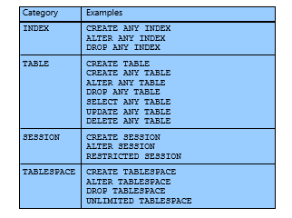
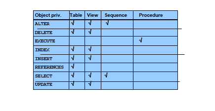
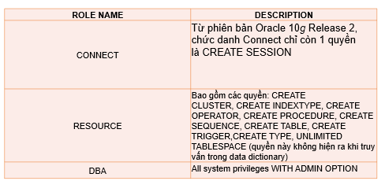

# Quyền và chức danh (PRIVILEGE & ROLE)

# Quyền

- Quyền của một user trong CSDL Oracle là một sự cho phép thực hiện 1 câu lệnh SQL hoặc được phép truy xuất đến một đối tượng nào đó.
- Có 2 loại quyền
  - Quyền hệ thống
  - Quyền đối tượng

1. Quyền hệ thống

- Cho phép user thực hiện các thao tác cụ thể trong CSDL.
- 

2. Quyền đối tượng

- Cho phép user truy xuất và thao tác trên một đối tượng cụ thể.
- 

3. Cú pháp

- ANY: user có quyền thao tác trong bất kỳ schema nào
- GRANT: Gắn quyền
- REVOKE: xóa quyền
- Quyền hệ thống:
  - VD: Gán quyền đăng nhập `GRANT CREATE SESSION TO emi;`
  - VD: Gán quyền đăng nhập và user được gán có quyền gán quyền đăng nhập cho user khác: `GRANT CREATE SESSION TO emi WITH ADMIN OPTION;`
  - VD: Gán tất cả quyền: `GRANT ALL PRIVILEGES TO super;`
  - VD: Thu hồi quyền: `REVOKE CREATE TABLE FROM emi;`
- Lưu ý:
  - > Sử dụng câu lệnh REVOKE để thu hồi một quyền hệ thống khỏi user
  - > Các user được gán quyền hệ thống với tùy chọn ADMIN OPTION có thể thu hồi quyền hệ thống đó của bất kỳ user.
  - > Chỉ các quyền được gán qua câu lệnh GRANT mới có thể bị thu hồi
- Quyền đối tượng:
  - VD: Gán quyền select: `GRANT UPDATE ON emi.customers TO jeff WITH GRANT OPTION;`
  - > Gán quyền đối tượng phải nằm trong schema của người gán hoặc người gán phải có tùy chọn WITH GRANT OPTION với quyền đó hoặc người gán có quyền hệ thống GRANT ANY OBJECT PRIVILEGE.
  - VD: Gán quyền hệ thống: `GRANT GRANT ANY OBJECT PRIVILEGE TO A;`
  - VD: thu hồi quyền `revoke select on APEX_DG_DATASET_ROWS from A;`
- Lưu ý:
  - > Sử dụng lệnh REVOKE để thu hồi các quyền đối tượng từ user.
  - Để 1 user REVOKE một quyền đối tượng từ 1 user khác, nó cần thỏa mãn 1 trong 2 điều kiện sau:
    - > Phải là user trực tiếp gán quyền đó
    - > Có quyền hệ thống : GRANT ANY OBJECT PRIVILEGE
- Lấy thông tin về quyền

  - > DBA_SYS_PRIVS: Hiển thị thông tin về tất cả các quyền hệ thống được gán cho user và role
  - > USER_SYS_PRIVS: Hiển thị thông tin về tất cả các quyền hệ thống được gán cho user hiện tại.
  - > DBA_TAB_PRIVS: Hiển thị tất cả các quyền đối tượng

- Bài tập:

  - Tao user: `CREATE USER A IDENTIFIED BY 1234 DEFAULT TABLESPACE USERS QUOTA 1M ON USERS;`
  - Gan quyen dang nhap cho A va a cos quyen gans quyen tao bang cho user khacs: `grant create session to A with admin option;`

  - gans quyeenf tao bang cho a và a có quyền tạo đăng nhập cho user khác: `grant create table to B with admin option;`

  - thu hồi quyền: `revoke create table from C;`

# chức danh

## Khái niệm

- Oracle cung cấp công cụ cho phép quản lý một cách dễ dàng các quyền thông qua việc sử dụng chức danh (Roles). Chức danh là một nhóm các quyền được đặt tên có liên quan đến nhau và được gán cho một user hay một chức danh khác
  

## Đặc điểm

- > Role có thể gán cho user hoặc role và thu hồi từ user hoặc role giống như gán và thu hồi quyền.
- > Role có thể gán cho bất kỳ user và role. Tuy nhiên, 1 role không thể gán cho chính nó hoặc gán vòng quanh.
- > Role có thể bao gồm cả quyền hệ thống và quyền đối tượng.
- > 1 user có thể enable, disable các role gán cho nó.
- > Khi 1 role có đặt mật khẩu, cần phải nhập mật khẩu khi enable role.
- > Tên của role phải duy nhất, không trùng tên với bất kỳ user hoặc role khác đã tồn tại trong CSDL.
- > Role không thuộc sở hữu của bất kỳ user và không được lưu trữ trong bất kỳ schema nào. Role được lưu trữ trong data dictionary.

## Cú pháp

1. Tạo

- Để tạo được role, user phải có quyền hệ thống CREATE ROLE.
- Không xác định: `CREATE ROLE r01 [NOT IDENTIFIED];`
- Có mật khẩu: `CREATE ROLE r02 IDENTIFIED BY abc123;`

2. Gán chức danh

- > Để gán chức danh cho 1 user hoặc role khác, user phải có chức danh đó với tùy chọn WITH ADMIN OPTION hoặc có quyền hệ thống: GRANT ANY ROLE
- > User tạo ra chức danh thì mặc định có tùy chọn WITH ADMIN OPTION đối với chức danh đó.
- VD:
  - `GRANT oe_clerk TO scott;`
  - `GRANT hr_manager TO scott WITH ADMIN OPTION;`
- Gán quyền hệ thống cho chức danh:
  - > Để gán 1 quyền hệ thống cho chức danh, user phải có tùy chọn WITH ADMIN OPTION với quyền hệ thống đó hoặc user phải có quyền GRANT ANY PRIVILEGE.
  - VD: `grant create table to R01;`
- Tùy chọn: ADMIN OPTION
  - > Tùy chọn WITH ADMIN OPTION sẽ cho phép người được cấp role/quyền:
  - > Cấp lại role/quyền đó cho một user hoặc role khác.
  - > Thu hồi lại role/quyền đó từ một user hoặc role bất kỳ.
  - > Thay đổi role đó bằng lệnh ALTER ROLE.
  - > Xóa role đó.
- Gán quyền đối tượng cho chức danh

  - `grant < quyen> to role`;
  - Điều kiện gán:
    - > User sở hữu đối tượng đó
    - > Tùy chọn WITH GRANT OPTION phải đi kèm khi gán quyền đối tượng đó cho user đó.
    - > User đó phải có quyền hệ thống GRANT ANY OBJECT PRIVILEGE
    - > Không có tùy chọn GRANT OPTION khi gán 1 quyền đối tượng cho chức danh.

- Enable và disable
  - > Trong 1 session, user có thể enable và disable các role mà được gán cho nó qua mệnh đề SET ROLE.
  - > Role có đặt mật khẩu cần phải chỉ rõ mật khẩu để enable role đó.
  - VD: `SET ROLE hr_clerk;`
  - VD có mật khẩu: `SET ROLE oe_clerk IDENTIFIED BY order;`
- Mật khẩu chức danh

  - Điều kiện:
    - > User phải có tùy chọn WITH ADMIN OPTION của chức danh đó.
    - > User phải có quyền ALTER ANY ROLE
  - VD:
    - Đặt mật khẩu `ALTER ROLE r01 IDENTIFIED BY abc123;`
    - Hủy mật khẩu: `ALTER ROLE r02 NOT IDENTIFIED;`

- Thu hồi chức danh khỏi user:

  - Điều kiện:
    - > Thu hồi các chức danh khỏi user đòi hỏi tùy chọn ADMIN OPTION hoặc quyền GRANT ANY ROLE.
  - VD: `REVOKE oe_clerk FROM scott;`

- Hủy chức danh:

  - Ảnh hưởng:
    - > Hủy bỏ chức danh đó với tất cả user và các chức danh mà nó được gán.
    - > Hủy bó nó khỏi CSDL.
  - Điều kiện:
    - > Đòi hỏi tùy chọn ADMIN OPTION hoặc quyền DROP ANY ROLE
  - VD: `DROP ROLE role`

- Lấy thông tin chức danh

  - > DBA_ROLES: Tất cả các chức danh có trong CSDL
  - > DBA_ROLE_PRIVS: Các chức danh gán cho user và chức danh
  - > DBA_SYS_PRIVS: Các quyền hệ thống gán cho user và chức danh
  - > ROLE_SYS_PRIVS: Các quyền hệ thống gán cho chức danh của user hiện tại.
  - > ROLE_TAB_PRIVS: Các quyền đối tượng gán cho chức danh
  - > SESSION_ROLES: Các chức danh user hiện enable

- Thiết lập chức danh mặc định:
  - > Một user có thể được gán nhiều chức danh.
  - > Mặc định khi chưa thiết lập chức danh mặc định, tất cả các chức danh được enable khi user đăng nhập.
  - > Khi thiết lập chức danh mặc định, thì chỉ các chức danh mặc định được enable khi user đăng nhập mà không phải nhập mật khẩu đối với các role có mật khẩu.
  - VD: `ALTER USER scott DEFAULT ROLE hr_clerk, oe_clerk;`
  - VD: mặc định tất cả: `ALTER USER scott DEFAULT ROLE ALL;`
  - VD: mặc định tất cả trừ: `ALTER USER scott DEFAULT ROLE ALL EXCEPT hr_clerk;`
  - VD: xóa bỏ hết role mặc đinh: `ALTER USER scott DEFAULT ROLE NONE;`
